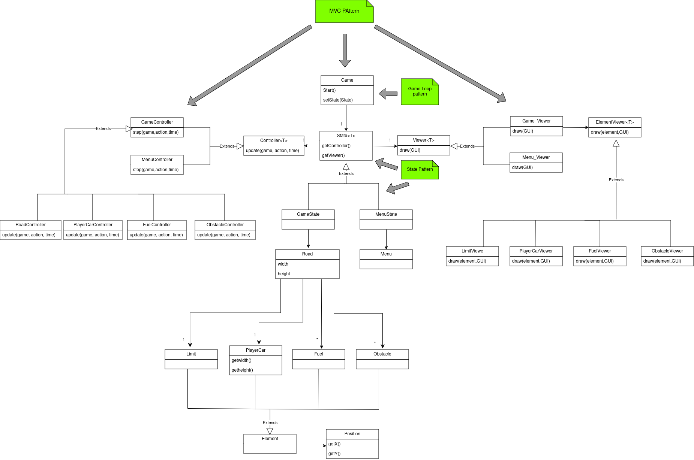
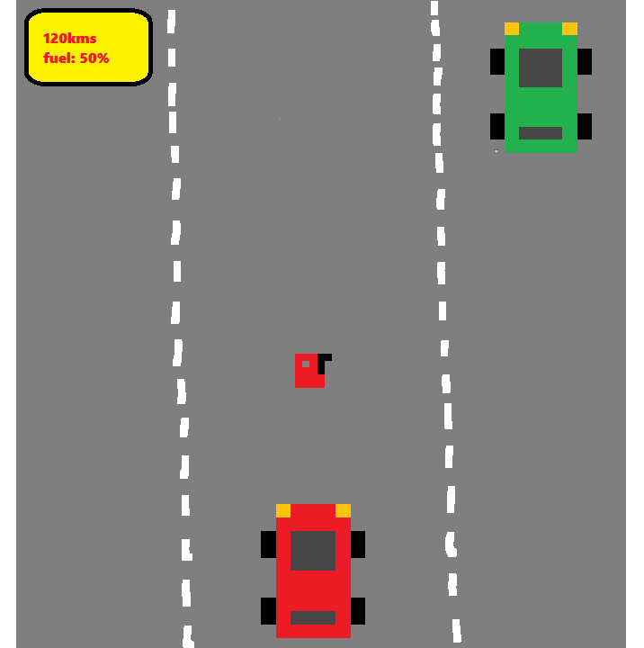

# DESCRIÇÃO

No nosso projeto iremos fazer um jogo 2D sobre carros onde o jogador controla um carro (PlayerCar) e o objetivo do jogo é percorrer a maior distância possível, sem perder, ou seja, sem bater com um carro num obstáculo da estrada.

>

>Este projeto foi feito por <a href="https://github.com/diogo-ribeiro-05">Diogo Ribeiro</a> (up202303899@fe.up.pt), <a href="https://github.com/GokuCraftdbz">Daniela Azevedo</a> (up202303896@fe.up.pt) and <a href="https://github.com/Bergilio">Pedro Salgado</a> (up202204914@fe.up.pt) for LDTS 2024/25
>

## IMPLEMENTED FEATURES

- **Tela de menu** - Tela de menu simples ao iniciar o jogo, que permite ao usuário escolher entre iniciar o jogo (start) ou sair do jogo (quit).

- **Movimento jogador** - O jogador pode se mover (usando as teclas de seta) unicamente em duas direções: para a esquerda, movendo, deste modo, o carro para a faixa da estrada mais próxima à esquerda, ou para a direita  movendo-se, deste modo, para a faixa da estrada mais próxima à direita.

- **Sistema colecionável** - os jogadores devem ir apanhando os galões de gasolina para, deste modo, ser possível percorrer mais quilómetros.

- **Condição de morte** - O jogo termina quando o carro do jogador colide com um obstáculo ou o carro fica sem combustível.

## UML Class Diagram

## GAME SCREENSHOTS AND MOCKUPS

CarPlayer:

Fuel:

Mockup:

