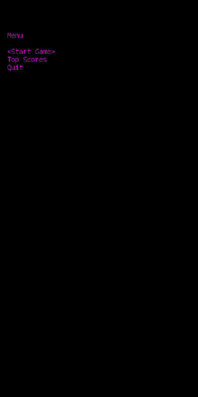
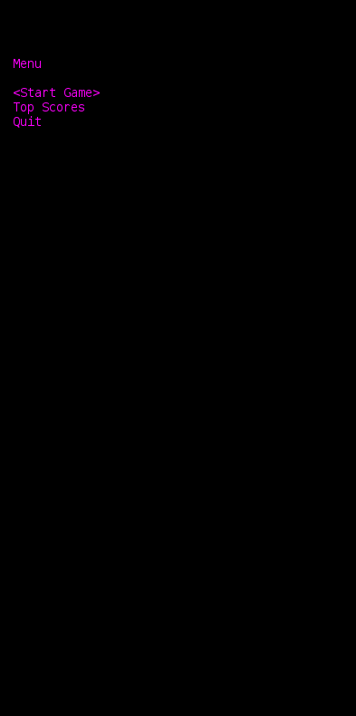
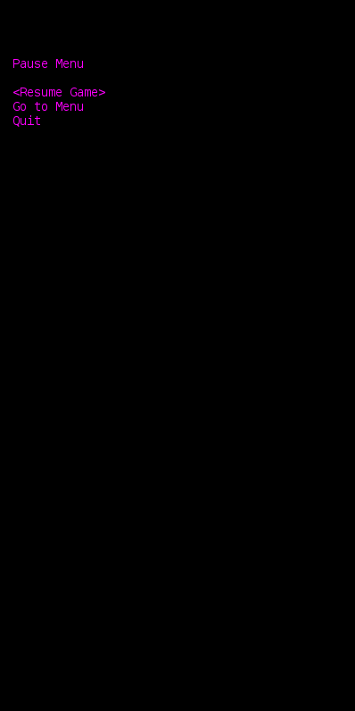
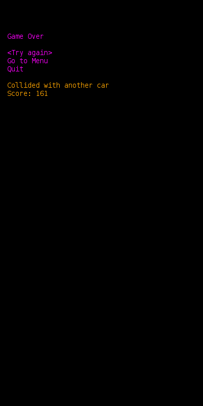
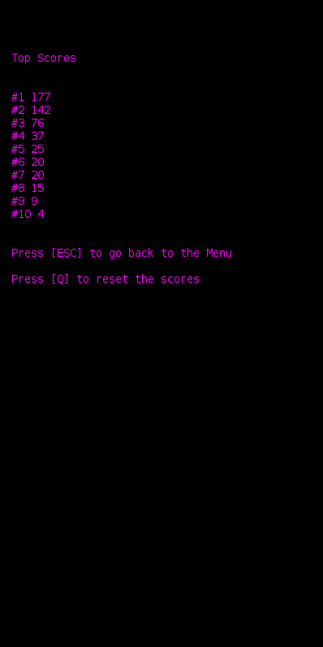

## LDTS_l06_g02 - Traffic Racer

This project is a remake of the Traffic Racer game, released in 2012.

In the game, the player controls a car speeding through traffic that has to avoid colliding with other cars, while collecting jerrycans
so that the car never runs out of fuel. 

The longer the player avoids running out of fuel or colliding with other cars, the higher the final score will be.  

This project was developed by:

- **Pedro Salgado** (up202204914)
- **Diana** ()
- **Diogo** ()

### GAME CONTROLS

- **Menus**
    - **Menu Navigation** - Up and Down arrow Keys;
    - **Menu Selection** - Enter Key;
    - **Exit from Score Menu** - Escape Key;
    - **Clear the Score Menu** - 'Q' key.

- **Game**
    - **Move** -  Left and Right Arrow Keys;
    - **Pause Game** - Escape Key.
    - **Quit Game** - 'Q' key.

### IMPLEMENTED FEATURES

- **Playable Character** - The playable character is a green car. Its movements are controlled using the left and right keys.

- **Obstacle Car** - The obstacles that the player needs to avoid are red cars. The cars are to be going at a lower velocity
forcing the player to move out of their way. They can collide with the player's car from all sides, ending the game.

- **Collectable Jerrycans** - The jerrycans are small red elements to be found in the road that can be caught by the player's car.
Collecting these increases the player's car fuel by a constant of 5.

- **Road** - The road where the game take place and all it's elements interact.

- **Road Limits** - The road limits are the straight lines on the sides of the road that delimit the size of the road and 
determines the extent of the player's car movement.

- **Dashed Lines** - The dashed lines in the middle of the road delimit the size of the lanes. Their purpose lies in giving
the sense of movement to the game, and they do not interact with the elements in the game.

- **Fuel Level** - The fuel level is displayed in the top left corner of the screen. It stars at 20 and the maximum amount
is 30. The fuel level consistently decreases by a constant of 1, and it increases by a constant of 5 if a jerrycan is collected.

- **Score** - The score is displayed in the top right corner of the screen. It starts at 0 and it increases constantly. In the end
of the game the score is stored so that it can be displayed in the score menu.

- **Collision** - The game detects if the player's car collides with the other elements. Collision with another car leads 
to the end of the game while collision with a jerrycan leads to the increase of the fuel level of the player's car.

- **Score Saving** - After finishing a game, the score is saved to file that can be found in "~/TrafficRacerFiles/Scores.txt".
The directory and file will be created if it does not exist. The file is read so that the scores can be display the scores in the score menu and only the 10 best are kept.

- **Main Menu** - The game Main Menu is accessed at the beginning of the game. It can also be accessed through the Pause menu and Game Over menu.
  It as the following options:
    - **Play** - Starts the game;
    - **Scores** - Accesses the scores menu;
    - **Quit** - Exits the game.

- **Scores Menu** - The Scores Menu can be accessed from the Main Menu. It displays the top ten scores form descending order, as well as the instructions to the available actions.
By pressing the following keys you can:
    - **Press Escape Key** - Go back to the main menu;
    - **Press 'Q' Key** - Clears the scoreboard.

- **Pause Menu** - Can be accessed pressing the escape key during the game. It as the following options:
    - **Resume Game** - Resumes the game;
    - **Go to Menu** - Goes back to the initial menu;
    - **Quit** - Exits the game.

- **Game Over Screen** - Is accessed when the player dies. 
    In an orange color, it is displayed the reason as to why the game was finished. The reasons are:
    - **Collided with another**;
    - **Ran out of fuel**;
    - **You quit the game**.
  
    The game over menu as the following options:

    - **Restart** - Restarts the game;
    - **Leaderboard** - Displays the top 5 best scores;
    - **Exit** - Exits the game.

### Screen Shots

- ### **Game**:

- ### **Start Menu**:

- ### **Pause Menu**:

- ### **GameOver Menu**:

- ### **ScoresMenu**:

    
### DESIGN

> This section should be organized in different subsections, each describing a different design problem that you had to solve during the project. Each subsection should be organized in four different parts:

- **Problem in Context.** The description of the design context and the concrete problem that motivated the instantiation of the pattern. Someone else other than the original developer should be able to read and understand all the motivations for the decisions made. When refering to the implementation before the pattern was applied, don’t forget to [link to the relevant lines of code](https://help.github.com/en/articles/creating-a-permanent-link-to-a-code-snippet) in the appropriate version.
- **The Pattern.** Identify the design pattern to be applied, why it was selected and how it is a good fit considering the existing design context and the problem at hand.
- **Implementation.** Show how the pattern roles, operations and associations were mapped to the concrete design classes. Illustrate it with a UML class diagram, and refer to the corresponding source code with links to the relevant lines (these should be [relative links](https://help.github.com/en/articles/about-readmes#relative-links-and-image-paths-in-readme-files). When doing this, always point to the latest version of the code.
- **Consequences.** Benefits and liabilities of the design after the pattern instantiation, eventually comparing these consequences with those of alternative solutions.

**Example of one of such subsections**:

------

#### THE JUMP ACTION OF THE KANGAROOBOY SHOULD BEHAVE DIFFERENTLY DEPENDING ON ITS STATE

**Problem in Context**

There was a lot of scattered conditional logic when deciding how the KangarooBoy should behave when jumping, as the jumps should be different depending on the items that came to his possession during the game (an helix will alow him to fly, driking a potion will allow him to jump double the height, etc.). This is a violation of the **Single Responsability Principle**. We could concentrate all the conditional logic in the same method to circumscribe the issue to that one method but the **Single Responsability Principle** would still be violated.

**The Pattern**

We have applied the **State** pattern. This pattern allows you to represent different states with different subclasses. We can switch to a different state of the application by switching to another implementation (i.e., another subclass). This pattern allowed to address the identified problems because […].

**Implementation**

The following figure shows how the pattern’s roles were mapped to the application classes.

These classes can be found in the following files:

- [Character](https://web.fe.up.pt/~arestivo/page/courses/2021/lpoo/template/src/main/java/Character.java)
- [JumpAbilityState](https://web.fe.up.pt/~arestivo/page/courses/2021/lpoo/template/src/main/java/JumpAbilityState.java)
- [DoubleJumpState](https://web.fe.up.pt/~arestivo/page/courses/2021/lpoo/template/src/main/java/DoubleJumpState.java)
- [HelicopterState](https://web.fe.up.pt/~arestivo/page/courses/2021/lpoo/template/src/main/java/HelicopterState.java)
- [IncreasedGravityState](https://web.fe.up.pt/~arestivo/page/courses/2021/lpoo/template/src/main/java/IncreasedGravityState.java)

**Consequences**

The use of the State Pattern in the current design allows the following benefits:

- The several states that represent the character’s hability to jump become explicit in the code, instead of relying on a series of flags.
- We don’t need to have a long set of conditional if or switch statements associated with the various states; instead, polimorphism is used to activate the right behavior.
- There are now more classes and instances to manage, but still in a reasonable number.

#### KNOWN CODE SMELLS

> This section should describe 3 to 5 different code smells that you have identified in your current implementation.

### TESTING

- Screenshot of coverage report.
- Link to mutation testing report.

### SELF-EVALUATION

> In this section describe how the work regarding the project was divided between the students. In the event that members of the group do not agree on a work distribution, the group should send an email to the teacher explaining the disagreement.

**Example**:

- John Doe: 40%
- Jane Doe: 60%