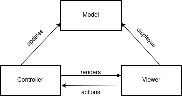
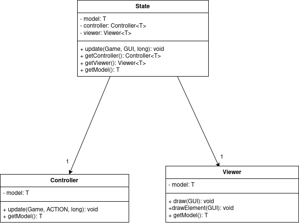
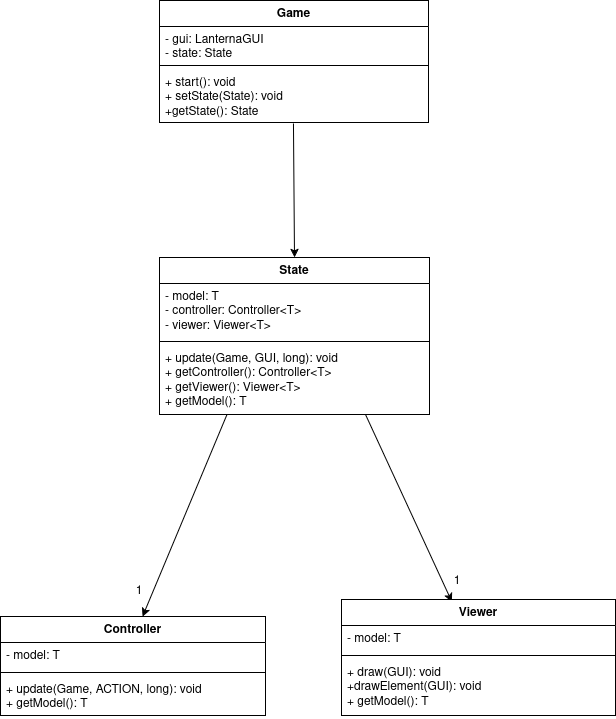
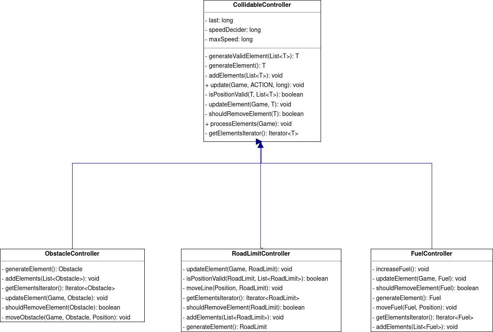

## LDTS_l06_g02 - Traffic Racer

This project is a remake of the Traffic Racer game, released in 2012.

In the game, the player controls a car speeding through traffic that has to avoid colliding with other cars, while collecting jerrycans
so that the car never runs out of fuel. 

The longer the player avoids running out of fuel or colliding with other cars, the higher the final score will be.  

This project was developed by:

- **Pedro Salgado** (up202204914)
- **Daniela Azevedo** (up202303896)
- **Diogo Ribeiro** (202303899)

### GAME CONTROLS

- **Menus**
    - **Menu Navigation** - Up and Down arrow Keys;
    - **Menu Selection** - Enter Key;
    - **Exit from Score Menu** - Escape Key;
    - **Clear the Score Menu** - 'Q' key.

- **Game**
    - **Move** - Left and Right Arrow Keys;
    - **Pause Game** - Escape Key.
    - **Quit Game** - 'Q' key.

### IMPLEMENTED FEATURES

- **Playable Character** - The playable character is a green car. Its movements are controlled using the left and right keys.

- **Obstacle Car** - The obstacles that the player needs to avoid are red cars. The cars are to be going at a lower velocity
forcing the player to move out of their way. They can collide with the player's car from all sides, ending the game.

- **Collectable Jerrycans** - The jerrycans are small red elements to be found in the road that can be caught by the player's car.
Collecting these increases the player's car fuel by a constant of 5.

- **Road** - The road where the game take place and all it's elements interact.

- **Road Limits** - The road limits are the straight lines on the sides of the road that delimit the size of the road and 
determines the extent of the player's car movement.

- **Dashed Lines** - The dashed lines in the middle of the road delimit the size of the lanes. Their purpose lies in giving
the sense of movement to the game, and they do not interact with the elements in the game.

- **Fuel Level** - The fuel level is displayed in the top left corner of the screen. It stars at 20 and the maximum amount
is 30. The fuel level consistently decreases by a constant of 1, and it increases by a constant of 5 if a jerrycan is collected.

- **Score** - The score is displayed in the top right corner of the screen. It starts at 0 and it increases constantly. In the end
of the game the score is stored so that it can be displayed in the score menu.

- **Collision** - The game detects if the player's car collides with the other elements. Collision with another car leads 
to the end of the game while collision with a jerrycan leads to the increase of the fuel level of the player's car.

- **Score Saving** - After finishing a game, the score is saved to file that can be found in "~/TrafficRacerFiles/Scores.txt".
The directory and file will be created if it does not exist. The file is read so that the scores can be display the scores in the score menu and only the 10 best are kept.

- **Main Menu** - The game Main Menu is accessed at the beginning of the game. It can also be accessed through the Pause menu and Game Over menu.
  It as the following options:
    - **Play** - Starts the game;
    - **Scores** - Accesses the scores menu;
    - **Quit** - Exits the game.

- **Scores Menu** - The Scores Menu can be accessed from the Main Menu. It displays the top ten scores form descending order, as well as the instructions to the available actions.
By pressing the following keys you can:
    - **Press Escape Key** - Go back to the main menu;
    - **Press 'Q' Key** - Clears the scoreboard.

- **Pause Menu** - Can be accessed pressing the escape key during the game. It as the following options:
    - **Resume Game** - Resumes the game;
    - **Go to Menu** - Goes back to the initial menu;
    - **Quit** - Exits the game.

- **Game Over Screen** - Is accessed when the player dies. 
    In an orange color, it is displayed the reason as to why the game was finished. The reasons are:
    - **Collided with another**;
    - **Ran out of fuel**;
    - **You quit the game**.
  
    The game over menu as the following options:

    - **Restart** - Restarts the game;
    - **Leaderboard** - Displays the top 5 best scores;
    - **Exit** - Exits the game.

### Screen Shots

- ### **Game**:

- ### **Start Menu**:

- ### **Pause Menu**:

- ### **GameOver Menu**:

- ### **ScoresMenu**:

    
### DESIGN

### Architecture Design

**Problem in Context**

The game logic, input handling and the rendering logic had to be separated to allow for better organizing of the responsibilities of different classes, to facilitate maintainability 
and scalability. The design should also facilitate testing, allowing for the testing of different responsibilities independently.

**The Pattern**

The Model-View-Controller (MVC) pattern was the clear choice to address the problem. The game logic, input handling and rendering logic are organized like this:

  - **Model** - Handles the game logic (and necessary data) needed for the game;
  - **Viewer** - Renders the game's graphical representation;
  - **Controller** - Updates the model according to input.

**Implementation**

Following the pattern, we divided the code base into four different parts:
  - **Model** - Has the basic logic to the elements of the application, as well as the necessary data;
  - **Viewer** - Draws the elements present in the Road object to the screen;
  - **GUI** - Basically extends the functionality of the Viewer by abstracting the logic to draw to the screen using the lanterna library;
  - **Controller** - Interprets the input in order to update the elements present in the Road object.

The implementation of the pattern can be found in the following packages:

- [Model](src/main/java/trafficracer/model)
- [Viewer](src/main/java/trafficracer/viewer)
- [Controller](src/main/java/trafficracer/controller)

**UML:**

**Consequences**

The use of the MVC Pattern in the current design allows the following benefits:

- **Maintainability**: The different components can be modified independently;
- **Scalability**: Adding new features to the game can be done without changing unrelated parts of the code base;
- **Testing**: Unit testing is easier to implement since different classes have almost unrelated responsibilities (the model in particular can be tested without the controller and viewer).

On the other hand the pattern can increase complexity, mostly in first steps of building the application, as there s still little definition on how things are going to be implemented.

### Application States

**Problem in Context**

The application has multiple states, like the game state, the menu state, the game over state, and more.
We needed a way to handle the different states of the application, while allowing it to scale if new states were to be added.

**The Pattern**

The patter chosen to address the problem was the State Pattern. It allows the application to change to its different states easily, simplifying the way the changes are handled.

**Implementation**

The State Pattern was implemented as follows:
  - **State** - This abstract class implements shared behaviour between the different states, like calling for the update from the controller, or the drawing from the viewer;
  - **Concrete States** - This classes implement the specific behaviour of the application states;
  - **Transition of States** - The transition between states is handled outside the state classes, mostly by the game class or the controllers.

The implementation of the pattern can be found in the following package: [State](src/main/java/trafficracer/state)

**UML:**

**Consequences**

The implementation of this pattern drastically simplified the way application states change from one to another. The only downside can be attributed to the slight increase in complexity.

### Continuous execution with the Game Loop

**Problem in Context**

A requirement for the functionality of any game is to process input, render frames, change states (according to input) and store the passage of time to allow control of the pace of the game
in a consistent way.

**The Pattern**

The Game Loop Pattern is widely used in the design of several games as it ensures consistent looping over the games' functionalities (input processing, updating and rendering).
It enforces the repeatedly cycling through the games' functionalities.

**Implementation**

The Game Loop was implemented within the Game class as follows:
  - **Initialization**: The game starts in the main menu state using the MenuState class.
  - **Loop Phases**: The start method repeatedly cycles through the loop phases, ensuring that updates and rendering happen.
  - **Frame Rate Control**: The loop calculates the time taken to process a frame and adjusts the sleep time to maintain a consistent frame rate.

The implementation of the pattern can be found in the following file: [Game](src/main/java/trafficracer/Game.java)

**UML:**

**Consequences**

The game runs consistently but it is important that the code inside the loop has good performance has the loop is going to be executed for a long time.

### Code Reusability and Consistency with Template Method Pattern

**Problem in Context**

At first, managing the different types of collidables (and their controllers) showed to be a challenge as code duplication led to a lot of maintenance difficulties.
Before applying the Template Method pattern, each collidable had its own controller class with duplicative code.

**The Pattern**

The Template Method pattern was the choice to address the problem. It allowed to implement a workflow in the abstract class
and delegate specific logic to the subclasses.

**Implementation**

The pattern was implemented in the following way:
  - **Abstract Class**: CollidableController defines the basic logic to update the different collidable elements.
      - Iterates through the list of elements;
      - Updates the element position;
      - Checks if the element should be removed;
      - Adds new elements as needed.
  - **Concrete Classes**: The subclasses implement the concrete logic for the steps taken in the abstract class.

The implementation of the pattern can be found in the following package: [Collidable Controllers](src/main/java/trafficracer/controller/game/collidable)

**UML:**

**Consequences**

This pattern solved the problem of code duplication since a big part is implemented in the abstract class and allows for easier extensibility, as it facilitates the addition of new elements.

### Continuous execution with the Game Loop

**Problem in Context**

A requirement for the functionality of any game is to process input, render frames, change states (according to input) and store the passage of time to allow control of the pace of the game
in a consistent way.

**The Pattern**

The Game Loop Pattern is widely used in the design of several games as it ensures consistent looping over the games' functionalities (input processing, updating and rendering).
It enforces the repeatedly cycling through the games' functionalities.

**Implementation**

The Game Loop was implemented within the Game class as follows:
- **Initialization**: The game starts in the main menu state using the MenuState class.
- **Loop Phases**: The start method repeatedly cycles through the loop phases, ensuring that updates and rendering happen.
- **Frame Rate Control**: The loop calculates the time taken to process a frame and adjusts the sleep time to maintain a consistent frame rate.

The implementation of the pattern can be found in the following file: [Game](src/main/java/trafficracer/Game.java)

**UML:**

**Consequences**

The game runs consistently but it is important that the code inside the loop has good performance has the loop is going to be executed for a long time.

### Single instance of an object with Singleton

**Problem in Context**

The game class is the central point of coordination of the application. It manages the game loop, the GUI  and the current state
so it is important to enforce that it can only exist a single instance of the Game class.

**The Pattern**

To address this problem, the Singleton Pattern was chosen, since the pattern only allows for one instance of a certain clas to be instantiated.
It is particular appropriate to use this pattern when a single point of control is necessary, and it achieves this by restricting the instantiation
to a single object, as well as providing a global access point to the instance.

**Implementation**

The implementation of the Game class with the singleton pattern goes like this:
  - **Private Constructor** - it can't be instantiated from outside the class;
  - **Static Instance** - it saves the single instance of the class;
  - **Global Access** - Provides global access to the instance with the getInstance() method.

The implementation of the pattern can be found in the following file: 

**UML:**

 [Game](src/main/java/trafficracer/Game.java)

**Consequences**

Reduced the possibility of bugs and/or unexpected behaviour happening.

#### KNOWN CODE SMELLS

> This section should describe 3 to 5 different code smells that you have identified in your current implementation.

### TESTING

- Screenshot of coverage report.
- Link to mutation testing report.

### SELF-EVALUATION

> In this section describe how the work regarding the project was divided between the students. In the event that members of the group do not agree on a work distribution, the group should send an email to the teacher explaining the disagreement.
